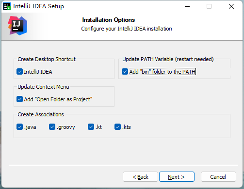
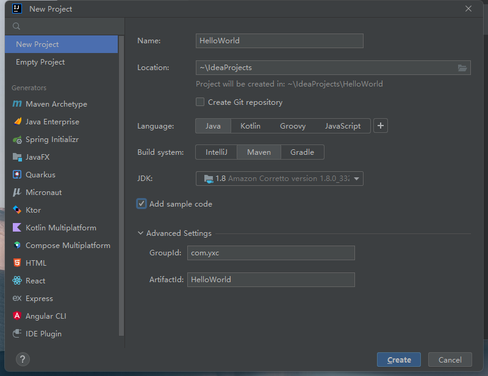
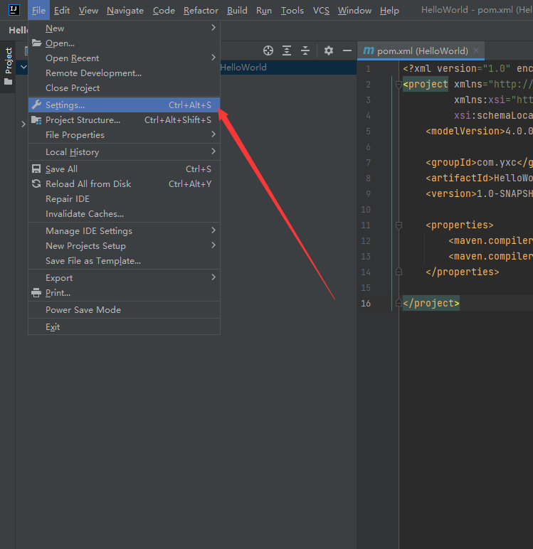
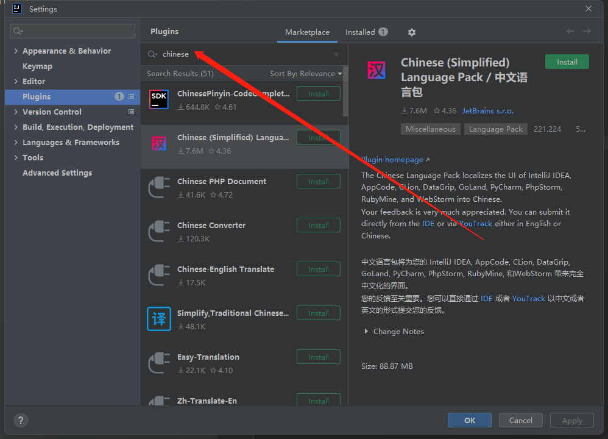
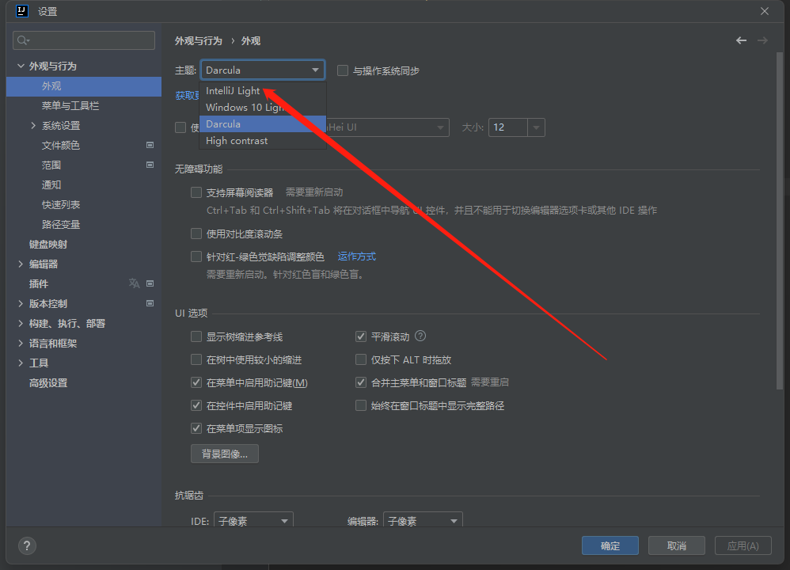

# 安装IDEA

## 1. 下载

- 官方下载地址（Windows系统）：https://www.jetbrains.com/zh-cn/idea/download/#section=windows
- 下载专业版（Ultimate版）

- - - - - -

## 2. 安装

下面的页面可以全选，其他页面一律默认即可。安装完需要重启电脑。

- - - - - -

## 3. 激活

优先下载最新专业版

- 试用30天：免费
- 教育邮箱(`xxx@xxx.edu.cn`)激活：免费
- 学信网激活：免费
- 在官网购买激活码：个人专业版1000元左右，可以购买当前版本的永久权限；更新版本需要1000元/年。
- 去淘宝买激活码：几块 - 几十元不等。
- 其它

- - - - - -

## 4. 新建项目

选项：

- Language：Java
- Build system：Maven
- JDK：1.8 （Amazon Corretto version 1.8.0_332）会自动安装，无需下载
- Add sample code：勾选上

## 5. 切换成中文界面

- - - - - -

## 6. 切成白色界面

